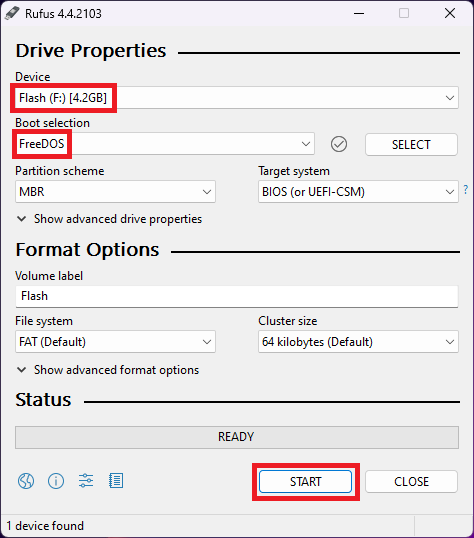

# How to flash PC ATI Radeon HD 4870's for the Mac Pro 

I used DOS to dump and flash the BIOS, you can probably use a different OS version if you want.

## Prerequisites
- Windows PC to create bootable FreeDOS USB.
- Linux PC with Python 2.7 to run the BIOS update scripts.
- A USB stick

## Files
| File | Comment | Use | 
| --- | --- | --- |
| `4870.ROM` | Stock Mac ATI 4870 BIOS (`DON'T flash!!!`)<br>Original files located in the `ROMs` folder. | Source for the EFI part of the Mac ROM |
| `PC4870.ROM` | The original BIOS you will dump from your ATI 4870. | Flash revert to original BIOS |
| `MAC4870.ROM` | The updated Mac compatible ATI 4870 BIOS! | Flash to make 4870 Mac Pro compatible |
| `amdflash.exe` | Download <a href="https://www.techpowerup.com/download/ati-atiflash/">amdvbflash_dos_4.68.zip</a> and extract the file `amdflash.exe` into the `USB` folder. | Utility that dumps and flashes the BIOS |

## Guide
1. Create bootable USB media with DOS (or something else with DOS)
   <br>I used a Windows PC and <a href="https://rufus.ie/">Rufus</a> to make a bootable USB stick with <a href="https://www.freedos.org/">FreeDOS</a>.
   

2. Copy the files in the folder `USB` to the USB stick. 
   <br>Remember to download <a href="https://www.techpowerup.com/download/ati-atiflash/">amdvbflash_dos_4.68.zip</a> and extract the `amdflash.exe` file to the `USB` folder.

   Place the files inside the `USB` folder on the root of the USB drive.

3. Boot from the USB stick into FreeDOS on the PC with the ATI Radeon HD 4870.

   I only had that one graphic card in the PC.
   <br>If you have multiple GPUs, the commands needs to be altered accordingly.
   <br>Basically, run `$ amdflash -i`, note the `adapter` number and replace the `0` number with it in the `backup.bat` and `flash.bat` files in the `USB` folder.

4. In FreeDOS, run the command: 
   <br>`$ backup`
   
   This will create a backup file named `PC4870.ROM` of the orignal BIOS for the ATI 4870.
   <br><b>Make a backup of the `PC4870.ROM` file somewhere safe!</b>

5. Copy the `PC4870.ROM` file into the folder `Scripts`.
   <br>There should also be a file named `4870.ROM` in that folder.

6. In `Linux`, open a terminal in the folder `Scripts` and run the commands:
   ```
   $ chmod +x update
   $ ./update
   ```

   This should create the updated Mac ATI 4870 BIOS file named `MAC4870.ROM`.
   <br>This file is a combination of your ATI 4870 cards BIOS and the EFI from the stock Mac ATI 4870 BIOS.
   
7. Copy the file `MAC4870.ROM` to the USB stick.

8. Boot from the USB stick into FreeDOS on the PC with the ATI Radeon HD 4870.

9. In FreeDOS, run the command: 
   <br>`$ flash`
   
   This will flash the new updated BIOS file `MAC4870.ROM` to the ATI 4870 graphics card.
   
10. Reboot the PC, and it should work.
    <br>My card continued to work normally in the PC I used to flash it with.
    <br>It should now be ready the be placed in your Mac Pro!

# Flash the original BIOS
Do this if you need to revert to the original BIOS or fix a "bad" flash.
<br>I have not tested this, but it should work maybe!? ;-)

In short, boot the PC with the ATI 4870 from the USB stick with FreeDOS.
<br>It should also contain the original `PC4870.ROM` file.
<br>Add a second GPU if required to get an image on the screen.

Run the following command and note what the `adapter` number (first column) is on the ATI 4870 card you want to recover.

`$ amdflash -i`

Run the following command to flash the original BIOS back onto the ATI 4870.
In this command example, the `adapter` number is 0 after the `-p`, change the 0 to match the number you noted above.

`$ amdflash -p 0 PC4870.ROM`


## Sources and Credits

My guide and partial file source is the forum post created by TheStrudel: 
- https://forums.macrumors.com/threads/working-flashable-pc-4870-card-thread.668710/

### fixrom.py 
Created by `pipomolo42`

### amdflash.exe
You can download the amdflash.exe file from https://www.techpowerup.com/download/ati-atiflash/ 
<br>Download the file `amdvbflash_dos_4.68.zip` which contains the DOS version, and extract the file `amdflash.exe`.